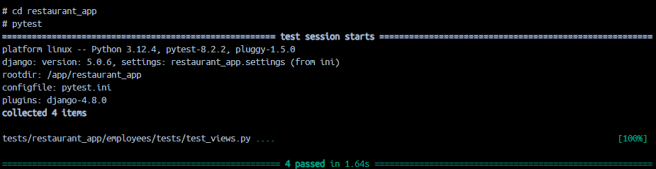

<h3>HOW TO RUN</h3>

1. Clone this project

2. Create .env file in restaurant_app directory and specify SECRET_KEY

2. Run docker-compose

<h3>TESTING</h3>
To run test execute 'pytest' at restaurant_app directory

